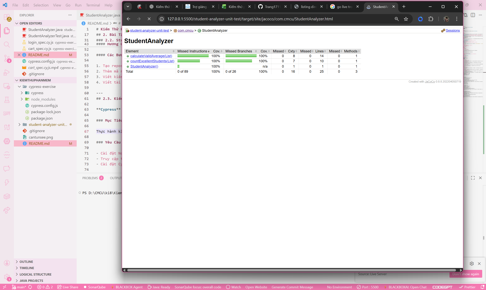

# Kiểm Thử Phần mềm

Repository lưu bài tập thực hành môn **Kiểm thử phần mềm**.

**Sinh viên:** Đỗ Lâm Trang  
**MSSV:** BIT230471  
**Lớp:** 23SOFT5

---

## 1. Giới Thiệu

Repository này được tạo để lưu trữ các bài tập thực hành môn **Kiểm thử phần mềm**.

---

## 2. Bài Tập

### 2.1. Cantunsee

**Cantunsee** là bài tập trong môn Kiểm thử phần mềm, giúp sinh viên trải nghiệm và đánh giá chất lượng giao diện phần mềm. Mục tiêu của bài tập là:

- **Trải nghiệm giao diện người dùng:** Kiểm tra tính dễ sử dụng và sự hợp lý của các yếu tố giao diện.
- **Phát hiện lỗi UI:** Nhận diện các vấn đề giao diện như bố cục không hợp lý, màu sắc khó nhìn, hoặc các nút bấm không hoạt động.

Bài tập này giúp sinh viên hiểu rõ hơn về việc kiểm thử giao diện và cải thiện trải nghiệm người dùng trong phần mềm.

Dưới đây là hình ảnh minh chứng đã chơi cantunse


### 2.2. StudentAnalyzer

**StudentAnalyzer** là một bài tập về kiểm thử đơn vị và xử lý dữ liệu trong Java. Chương trình phân tích danh sách điểm của học sinh và thực hiện các thao tác sau:

1. **Phân tích số học sinh đạt loại Giỏi** (>= 8.0).
2. **Tính điểm trung bình hợp lệ** từ các điểm trong danh sách (0 đến 10).

#### Hướng Dẫn Chạy Chương Trình

1. **Cài đặt JUnit:** Đảm bảo bạn có JUnit trong dự án của mình.
2. **Chạy chương trình:** Bạn có thể chạy chương trình qua IDE hoặc qua dòng lệnh.

#### Hướng Dẫn Kiểm Thử

Để chạy các bài kiểm thử, sử dụng **JUnit** để kiểm tra các phương thức `countExcellentStudents()` và `calculateValidAverage()`.

##### Các ca kiểm thử:

- Kiểm thử với danh sách có điểm hợp lệ và không hợp lệ.
- Kiểm thử với danh sách trống.
- Kiểm thử với giá trị biên (0 và 10).

#### Các Bước Thực Hiện:

1. Tạo repository.
2. Thêm mã nguồn.
3. Viết kiểm thử đơn vị.
4. Viết tài liệu README.

---
## 2.3. Kiểm Thử Tự Động với Cypress

**Cypress** là công cụ kiểm thử tự động end-to-end giúp kiểm tra các ứng dụng web.

### Mục Tiêu

Thực hành kiểm thử tự động với Cypress trên trang web mẫu.

### Yêu Cầu

- Cài đặt Node.js (v14+), Visual Studio Code.
- Truy cập trang web: [https://www.saucedemo.com](https://www.saucedemo.com).
- Cài đặt Cypress.

### Hướng Dẫn Cài Đặt

1. **Tạo thư mục và khởi tạo npm:**
   ```bash
   mkdir cypress-exercise
   cd cypress-exercise
   npm init -y
2. **Cài đặt Cypress:**
 npm install cypress --save-dev
3. **Mở Cypress:**
 npx cypress open

### Các Kịch Bản Kiểm Thử

#### Kịch bản 1: Đăng nhập thành công

**Mô tả:** Thực hiện đăng nhập với thông tin hợp lệ và xác nhận việc đăng nhập thành công bằng cách kiểm tra sự xuất hiện của các yếu tố giao diện.

#### Kịch bản 2: Đăng nhập thất bại

**Mô tả:** Thực hiện đăng nhập với thông tin không hợp lệ và xác nhận rằng thông báo lỗi hiển thị đúng.

#### Kịch bản 3: Thêm sản phẩm vào giỏ hàng

**Mô tả:** Chọn sản phẩm từ trang sản phẩm và thêm vào giỏ hàng, sau đó xác minh rằng giỏ hàng đã được cập nhật đúng.

#### Kịch bản 4: Tìm kiếm sản phẩm

**Mô tả:** Thực hiện tìm kiếm sản phẩm bằng tên và xác nhận rằng kết quả tìm kiếm đúng với yêu cầu.

### Bài Tập Yêu Cầu

#### Xóa sản phẩm khỏi giỏ hàng

**Mô tả:** Thêm một sản phẩm vào giỏ hàng, sau đó nhấn vào nút "Remove" và xác minh rằng giỏ hàng trở thành rỗng.

#### Quy trình thanh toán

**Mô tả:** Đăng nhập với tài khoản hợp lệ, thêm sản phẩm vào giỏ hàng, tiến hành thanh toán và xác nhận việc chuyển đến trang xác nhận.

## 2.4. Kiểm Thử `StudentAnalyzer` với JUnit

Trong bài tập `StudentAnalyzer`, sinh viên thực hiện kiểm thử đơn vị (unit test) bằng JUnit, áp dụng các kỹ thuật thiết kế ca kiểm thử (test case design techniques) và đo độ bao phủ mã nguồn (code coverage) bằng JaCoCo.

### 2.4.1. Kiểm Thử với Bảng Quyết Định (Decision Table – DT)

Kỹ thuật Decision Table được dùng để liệt kê rõ ràng các điều kiện đầu vào và hành vi mong đợi của chương trình.  
Trong bài này, bảng quyết định được xây dựng cho hai phương thức:

- `countExcellentStudents(List<Double> scores)`
- `calculateValidAverage(List<Double> scores)`

Các trường hợp điển hình được kiểm thử bao gồm:

- `scores == null`
- `scores` rỗng
- Không có điểm hợp lệ
- Có điểm hợp lệ nhưng không có học sinh Giỏi (`score >= 8.0`)
- Có học sinh Giỏi và trả về số lượng chính xác
- Có điểm hợp lệ để tính trung bình hợp lệ

Mỗi quy tắc trong bảng quyết định được ánh xạ thành **ít nhất một ca kiểm thử JUnit**, đảm bảo:

- Mỗi tổ hợp điều kiện – kết quả mong đợi đều có test đại diện.
- Hạn chế trùng lặp không cần thiết nhưng vẫn đảm bảo bao phủ đầy đủ các quy tắc trong Decision Table.

### 2.4.2. Kiểm Thử với Giá Trị Biên (Boundary Value Analysis – BVA)

Kỹ thuật BVA được sử dụng để kiểm tra hành vi của chương trình tại các vùng biên “nhạy cảm” – nơi lỗi thường xuất hiện.  
Các biên trong bài toán bao gồm:

- Biên miền hợp lệ: `0.0` và `10.0`
- Biên ngưỡng Giỏi: `7.99`, `8.0`, `9.0`
- Giá trị ngoài miền: `< 0.0`, `> 10.0`
- Phần tử `null` trong danh sách

Các ca kiểm thử được thiết kế nhằm:

- Kiểm tra điểm **ngay dưới** và **ngay trên** ngưỡng Giỏi (`7.99` vs `8.0`).
- Kiểm tra các giá trị **biên của miền hợp lệ** (`0.0`, `10.0`).
- Kiểm tra trường hợp **hỗn hợp**: điểm hợp lệ, không hợp lệ và `null` cùng xuất hiện trong một danh sách.

### 2.4.3. Kiểm Thử với Lớp Tương Đương (Equivalence Partitioning – EP)

Kỹ thuật EP được áp dụng để chia miền giá trị đầu vào thành các lớp dữ liệu mà chương trình xử lý theo cách tương tự.  
Trong bài này, các lớp tương đương chính bao gồm:

- `scores == null`
- `scores` rỗng
- `scores` không rỗng nhưng **không có điểm hợp lệ**
- `scores` có **ít nhất một điểm hợp lệ** (có thể kèm giá trị invalid và `null`)

Đối với từng lớp tương đương, một ca kiểm thử đại diện được lựa chọn với mục tiêu:

- Giảm số lượng test trùng lặp.
- Vẫn đảm bảo bao phủ hành vi xử lý của chương trình đối với từng lớp dữ liệu khác nhau.
- Tối ưu thời gian chạy test mà không làm giảm chất lượng kiểm thử.

### 2.4.4. Đo Độ Bao Phủ Mã Nguồn với JaCoCo

Để đánh giá hiệu quả bộ test, dự án sử dụng công cụ **JaCoCo** để đo độ bao phủ mã nguồn:

- **Line Coverage**: tỷ lệ số dòng lệnh được thực thi khi chạy test.
- **Branch Coverage**: tỷ lệ các nhánh rẽ (if/else, switch, …) được bao phủ.

Quy trình thực hiện:

1. Chạy lệnh:
   - Với Maven: `mvn test`
   - Hoặc với Gradle: `gradle test`
2. JaCoCo sinh báo cáo HTML trong thư mục `target/site/jacoco` (Maven) hoặc tương ứng với Gradle.
3. Mở file `index.html` trong trình duyệt để xem báo cáo chi tiết.

Bộ test được thiết kế nhằm:

- Đạt **độ bao phủ cao** cho cả line coverage và branch coverage.
- Đảm bảo mọi nhánh xử lý quan trọng trong hai phương thức `countExcellentStudents` và `calculateValidAverage` đều được kiểm tra.
- Hạn chế tối đa các nhánh “chưa được chạm tới” (uncovered branches) trong báo cáo JaCoCo.
 Dưới đây là hình ảnh minh chứng đã thực hiện đo bao phủ kiểm thử:
 